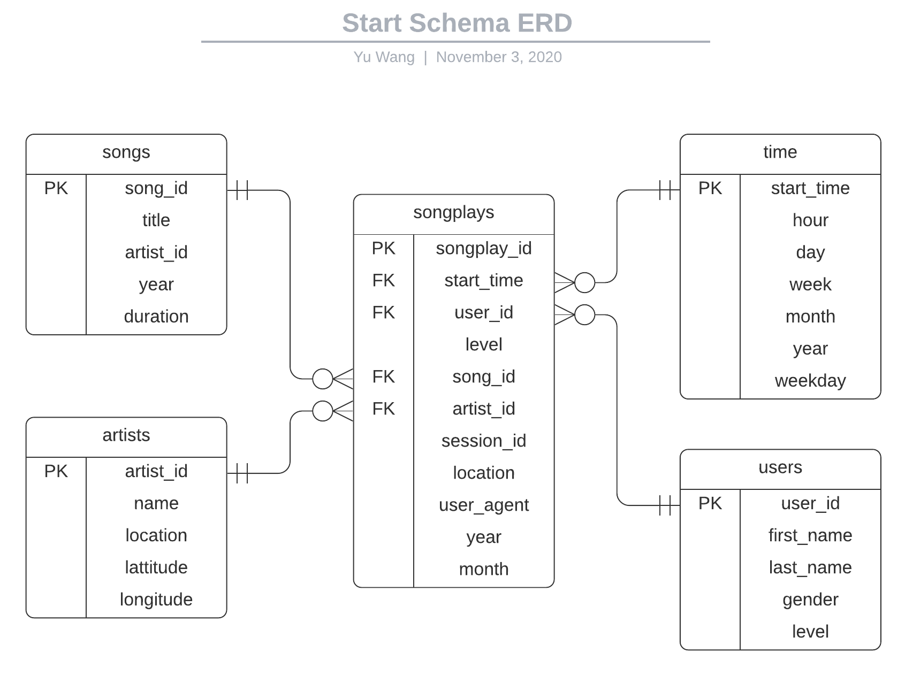

# Data Engineer Nanodegree Subproject
The repository contains the project information of the **Data Lake with AWS EMR** from Udacity Nanodegree 
**[Data Engineer](https://www.udacity.com/course/data-engineer-nanodegree--nd027)**. Please refer to the 
course [website](https://www.udacity.com/course/data-engineer-nanodegree--nd027) for more details. 

Project scenario: A startup called Sparkify has grown their user base and song database even more and want to store 
their analytical tables to data lakes on AWS S3. Their original data resides in AWS S3 including user activity logs and 
song metadata in *JSON* format. 

## Business Process / Data Requirements
- Analytics team wants to understand **what songs** their **users** are listening to by analyzing a set of dimensional/fact tables.
- Analytics team wants a **Data Lake on the cloud** with tables designed to **perform analytical queries** and gain insights on song plays.

## Engineering Task
- Create and launch a EMR cluster with Spark on AWS 
  - Create a EMR cluster with access to S3 using emr version 6.1.0
- Create a star schema and ETL pipeline to prepare the data for analytics team
  - Define fact & dimension tables/DataFrames for a star schema for this particular analytic purpose
  - Explore raw data (*JSON*) locally using Jupyter notebook to establish step-by-step pipeline
  - Write an ETL pipeline to load data from AWS S3 bucket and process it with Spark Cluster on AWS
  - Load processed tables/DataFrames back to S3 buckets for later analytical usage
- Launch an AWS EMR notebook and run some test queries

## Tools Used
- Python 3
- [AWS](https://aws.amazon.com/)
- [EMR Cluster](https://docs.aws.amazon.com/redshift/latest/dg/welcome.html)
- [AWS S3](https://docs.aws.amazon.com/AmazonS3/latest/dev/Welcome.html)
- [AWS CLI](https://docs.aws.amazon.com/cli/latest/reference/emr/create-cluster.html)
- [Spark](https://spark.apache.org/docs/latest/index.html)
- [LucidChart](https://www.lucidchart.com/)

## Original Data Sources
**Note** that the actual data (in *JSON*) used in this project is a subset of original dataset preprocessed by the course. The provided data 
resides in AWS S3 (publically available).
1. Song data from [Million Song Dataset](http://millionsongdataset.com/)
2. User activity data from [Event Simulator](https://github.com/Interana/eventsim) based on [Million Song Dataset](http://millionsongdataset.com/)

## Database Schema (Data Lake) Design
**User Story**: A **user** plays a **song** whose artist is **artist_name** at time **start_time** using **agent**. 
From the above story, we can extract the necessary information/dimensions:

- **Who**: **users** dimension
- **What**: **songs** and **artists** dimension
- **When**: **time** dimension
- **How (many)**: **songplays** fact
- (More possible dimensions but not used in this project):
    - **Where**: **locations** dimension
    - **How**: **agents** dimension

Since the core business process/metric is an user playing a song, the fact table should store the song play records with 
user/song identifier together with related information about the how and where the song is played. Based on the data and tables 
given in the project, the star schema looks like this (generated using [LucidChart](https://www.lucidchart.com/)):

## Usage and Sample Results
There are 2 ways to run this project: 
1. Locally on your machine with Python Notebook or Python script
2. On AWS EMR cluster (requires AWS credentials)
However, you can run sample queries either locally on your machine or on AWS cluster.

### Run locally

### Run on AWS EMR cluster

### Sample Queries (on AWS EMR notebook)

## Resources
1. [AWS EMR Management](https://docs.aws.amazon.com/emr/latest/ManagementGuide/index.html): how to create and manage EMR clusters on AWS.
3. [Spark Document](https://spark.apache.org/docs/latest/index.html): how to use spark with python
5. [AWS CLI](https://docs.aws.amazon.com/cli/latest/reference/emr/create-cluster.html): how to use AWS CLI to manage EMR clusters.

