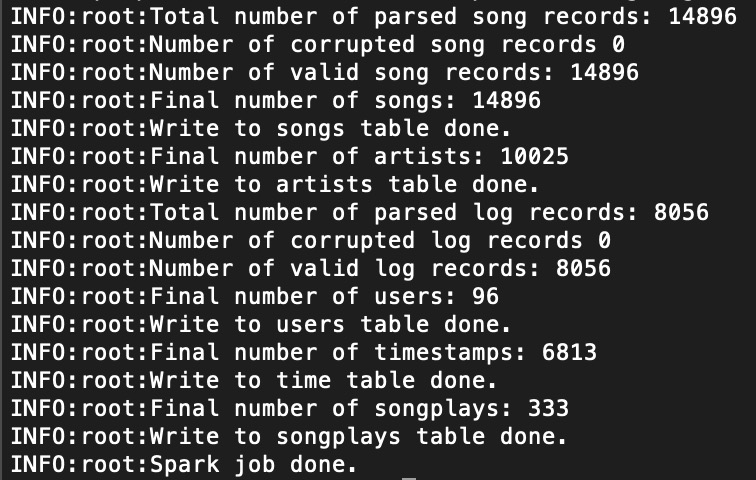
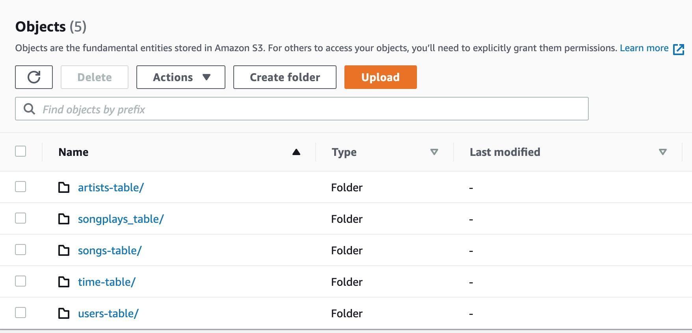

# Data Engineer Nanodegree Subproject
The repository contains the project information of the **Data Lake with AWS EMR** from Udacity Nanodegree 
**[Data Engineer](https://www.udacity.com/course/data-engineer-nanodegree--nd027)**. Please refer to the 
course [website](https://www.udacity.com/course/data-engineer-nanodegree--nd027) for more details.<br/>

Project scenario: A startup called Sparkify has grown their user base and song database even more and want to store 
their analytical tables to data lakes on AWS S3. Their original data resides in AWS S3 including user activity logs and 
song metadata in *JSON* format.<br/>

## Business Process / Data Requirements
- Analytics team wants to understand **what songs** their **users** are listening to by analyzing a set of dimensional/fact tables.
- Analytics team wants a **Data Lake on the cloud** with tables designed to **perform analytical queries** and gain insights on song plays.

## Engineering Task
- Create and launch a EMR cluster with Spark on AWS 
  - Create a EMR cluster with access to S3 using emr version 6.1.0
- Create a star schema and ETL pipeline to prepare the data for analytics team
  - Define fact & dimension tables/DataFrames for a star schema for this particular analytic purpose
  - Explore raw data (*JSON*) locally using Jupyter notebook to establish step-by-step pipeline
  - Write an ETL pipeline to load data from AWS S3 bucket and process it with Spark Cluster on AWS
  - Load processed tables/DataFrames back to S3 buckets for later analytical usage
- Launch an AWS EMR notebook and run some test queries

## Tools Used
- Python 3
- [AWS](https://aws.amazon.com/)
- [EMR Cluster](https://docs.aws.amazon.com/redshift/latest/dg/welcome.html)
- [AWS S3](https://docs.aws.amazon.com/AmazonS3/latest/dev/Welcome.html)
- [AWS CLI](https://docs.aws.amazon.com/cli/latest/reference/emr/create-cluster.html)
- [Spark](https://spark.apache.org/docs/latest/index.html)
- [LucidChart](https://www.lucidchart.com/)

## Original Data Sources
**Note** that the actual data (in *JSON*) used in this project is a subset of original dataset preprocessed by the course. The provided data 
resides in AWS S3 (publically available).
1. Song data from [Million Song Dataset](http://millionsongdataset.com/)
2. User activity data from [Event Simulator](https://github.com/Interana/eventsim) based on [Million Song Dataset](http://millionsongdataset.com/)

## Database Schema (Data Lake) Design
**User Story**: A **user** plays a **song** whose artist is **artist_name** at time **start_time** using **agent**.<br/>
From the above story, we can extract the necessary information/dimensions:

- **Who**: **users** dimension
- **What**: **songs** and **artists** dimension
- **When**: **time** dimension
- **How (many)**: **songplays** fact
- (More possible dimensions but not used in this project):
    - **Where**: **locations** dimension
    - **How**: **agents** dimension

Since the core business process/metric is an user playing a song, the fact table should store the song play records with 
user/song identifier together with related information about the how and where the song is played. Based on the data and tables 
given in the project, the star schema looks like this (generated using [LucidChart](https://www.lucidchart.com/)):


## Usage and Sample Results
There are 2 ways to run this project:<br/>
1. Locally on your machine with Jupyter-notebook (elt-test.ipynb) or Python script (etl.py)
2. On AWS EMR cluster (requires AWS credentials)<br/>

We encourage you run this project locally first to make sure everthing's working such as Software/Package APIs compatibility. 
However, you can run sample queries either locally on your machine or on AWS cluster.

### Run locally
**IMPORTANT IMPORTANT IMPORTANT** you must comment/uncomment codes in ``main()`` function.
- Using notebook **elt-test.ipynb** and following the step-by-step instructions
- **OR** using script **etl.py**, run the script with following command:<br/>
``spark-submit --master local etl.py``

### Run on AWS EMR cluster
This requires you to create EMR cluster, secure copy script to master node, SSH to master node and submit spark job.<br/>
**IMPORTANT IMPORTANT IMPORTANT** you must comment/uncomment codes in ``main()`` function.

#### Step 1. Configure AWS Credentials (required to create EMR Cluster via AWS CLI)
- Save your credentials (**aws_access_key_id**, **aws_secret_access_key**) to ``~/.aws/credentials`` on your machine
- **OR** export to environment variables:
<br    >``export AWS_ACCESS_KEY_ID=<your_access_key_id>`` 
<br    >``export AWS_SECRET_ACCESS_KEY=<your_secret_access_key>``<br/><br/>
For more info, reference to this [guide](https://boto3.amazonaws.com/v1/documentation/api/latest/guide/credentials.html).

#### Step 2. Setup AWS Region
- Save your region name to ``~/.aws/config`` on your machine
- **OR** export to environment variables:
<br    >``export AWS_DEFAULT_REGION=us-west-2``<br/><br/>
For more info, reference to this [guide](https://boto3.amazonaws.com/v1/documentation/api/latest/guide/configuration.html).

#### Step 3. Create SSH Key-Pair (required to SSH remote login)
- Follow this [guide](https://docs.aws.amazon.com/emr/latest/ManagementGuide/emr-connect-master-node.html) to create SSH key-pair and 
configure inbound rules for SSH
- Save your secret key file to ``~/.ssh/``

#### Step 4. Create AWS EMR Cluster
Using the following AWS CLI command:
```
aws emr create-cluster --name <YOUR_CLUSTER_NAME> \
--use-default-roles \
--release-label emr-6.1.0 \
--instance-count 4 \
--instance-type m5.xlarge \
--applications Name=Spark Name=Hadoop Name=Livy \
--ec2-attributes KeyName=<YOUR_KEY_NAME>,SubnetId=<YOUR_SUBNET_ID>
```
Replace ``YOUR_CLUSTER_NAME``, ``YOUR_KEY_NAME`` and ``YOUR_SUBNET_ID``. This step may take up to 5 minutes.

#### Step 5. Prepare script and dynamic port-forwarding
Once the EMR cluster is running and waiting, you can proceed with following steps:
- Secure copy the script to EMR Master Node:
<br    >``scp -i ~/.ssh/<YOUR_KEY_FILE_NAME>.pem etl.py hadoop@<MASTER_NODE_PUBLIC_DNS>:/home/hadoop``
- Open SSH tunnel on your machine (assume using port **8157**)
<br    >``ssh -i ~/.ssh/<YOUR_KEY_FILE_NAME>.pem -ND 8157 hadoop@<MASTER_NODE_PUBLIC_DNS>``<br/>
Configure and use Proxy on your browser to use Spark UI. For more info, reference to this [guide](https://docs.aws.amazon.com/emr/latest/ManagementGuide/emr-connect-master-node-proxy.html)
- Create S3 bucket named ``udacity-de-datalake`` for your IAM user and make sure your EMR cluster has **Full Access** to this bucket.<br/>

Replace ``YOUR_KEY_FILE_NAME`` and ``MASTER_NODE_PUBLIC_DNS`` for the commands above.

#### Step 6. SSH to Master Node and submit spark job
- SSH to Master Node:
<br    >``ssh -i ~/.ssh/<YOUR_KEY_FILE_NAME>.pem hadoop@<MASTER_NODE_PUBLIC_DNS>``
- Submit spark job:
<br    >``spark-submit --master yarn etl.py``<br/>

Replace ``YOUR_KEY_FILE_NAME`` and ``MASTER_NODE_PUBLIC_DNS`` for the commands above. The spark job should finish within 10 minutes. 
In the mean time, you can monitor the spark job using Spark UI.

#### Step 7. Check Logging and S3 bucket
- To make sure spark job is successful, view the log file in **Master Node terminal**:
<br    >``cat spark-etl-log.log``
<br    >
- To view stored files in S3 buckets, you should have something like this in your bucket ``udacity-de-datalake``:



### Sample Queries (on AWS EMR notebook)
We only provide instructions on runing queries on EMR notebook, however the same queries can also be run locally if you choose to run the project locally.

#### Create EMR Notebook
Create an EMR notebook and attach the notebook to previously(or newly) created cluster.

#### Run Queries in notebook
Check ``emr-nb-query.ipynb`` for complete info. Note that this notebook can only run on EMR cluster.

## Resources
1. [AWS EMR Management](https://docs.aws.amazon.com/emr/latest/ManagementGuide/index.html): how to create and manage EMR clusters on AWS.
3. [Spark Document](https://spark.apache.org/docs/latest/index.html): how to use spark with python
5. [AWS CLI](https://docs.aws.amazon.com/cli/latest/reference/emr/create-cluster.html): how to use AWS CLI to manage EMR clusters.

